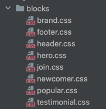

# Страница antools.
Тестовое задание для DevCrew

<a href="https://mordvintsevmv.github.io/devcrew_test" target="_blank">Проверить работу</a>

---

## <a name="content">Оглавление</a>

0. [Задание](#task)
1. [Реализация](#realization)
2. [Контакты](#contacts)

[🔝К оглавлению🔝](#content)

---

## <a name="task">Задание</a>

Сверстать страницу по макету.

[🔝К оглавлению🔝](#content)

---

## <a name="realization">Реализация</a>

Для удобства все стили были поделены на блоки и отдельные элементы,
которые используются несколько раз на странице.

---

Например, все стили по блокам (названия выбраны в соответствии с макетом):

*style/blocks*

---

Для общих стилей были созданы отдельные файлы:

**main.css** - общие элементы (оранжевая кнопка, форма и т.д.)

**fonts.css** - стили для шрифта (h1, h2, ..., p)

**tools.css** - стилизация блоков инструментов (Figma, Zeplin и т.д.) 

**null.css** - обнуление стандартных стилей

[🔝К оглавлению🔝](#content)

---

## <a name="contacts">Контакты</a>

**TG**: @mordvintsevmv

**e-mail**: mordvintsevmv@gmail.com

[🔝К оглавлению🔝](#content)

